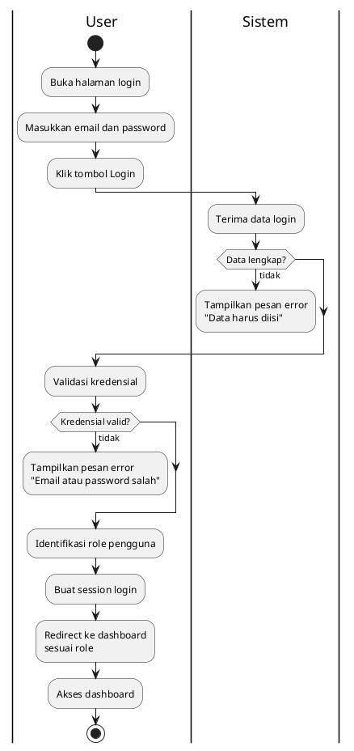
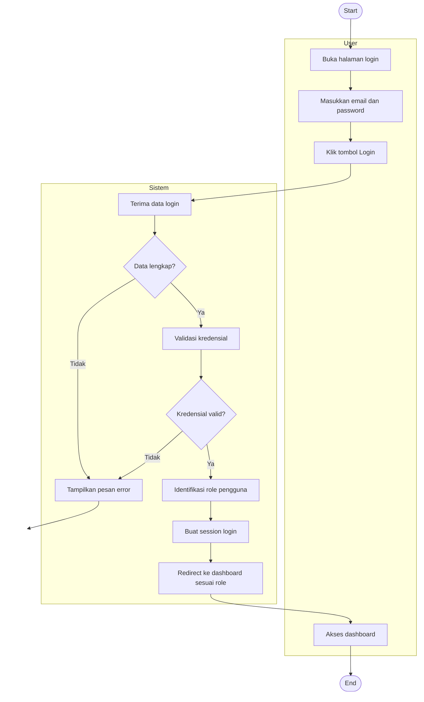

# Activity Diagram - Login Sistem

## Versi Mermaid

## Penjelasan:

### Swimlane:
- **User**: Aktivitas yang dilakukan pengguna
- **Sistem**: Proses yang dilakukan sistem

### Alur Proses:
1. User membuka halaman login dan memasukkan kredensial
2. Sistem memvalidasi kelengkapan data
3. Jika tidak lengkap → tampilkan error (flow berakhir)
4. Sistem memvalidasi kredensial
5. Jika tidak valid → tampilkan error (flow berakhir)
6. Sistem identifikasi role (Admin/Guru/Siswa)
7. Sistem membuat session dan redirect ke dashboard
8. User mengakses dashboard sesuai role

### Karakteristik:
- **1 Start, 1 End** (standar UML)
- **Decision node** untuk validasi
- **Swimlane** memisahkan aktor dan sistem
- **Sederhana** tanpa detail teknis implementasi
- **Fokus** pada alur bisnis utama
