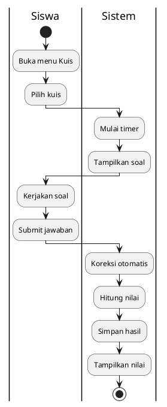

# Activity Diagram - Kerjakan Kuis (Siswa)



## Penjelasan:

### Fitur:
- **Filter Otomatis**: Kuis sesuai kelas/jurusan siswa
- **One-Time**: Sekali kerjakan, tidak bisa ulang
- **Timer**: Auto-submit jika waktu habis
- **Auto Grading**: Sistem koreksi otomatis

### Perhitungan Nilai:
```
Nilai = (Jumlah Benar / Total Soal) × 100
```
