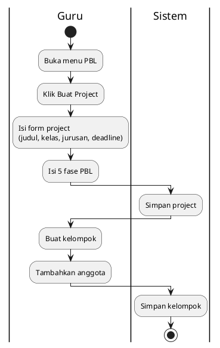

# Activity Diagram - PBL - Buat Project (Guru)

## Penjelasan:

### Langkah:
1. **Buat Project**: Isi 5 fase PBL sekaligus
2. **Buat Kelompok**: Nama kelompok (anggota kosong)
3. **Assign Siswa**: Tambahkan siswa ke kelompok

### 5 Fase PBL:
1. Orientasi Masalah
2. Organisasi Belajar
3. Penyelidikan
4. Hasil Karya
5. Evaluasi (penilaian)
