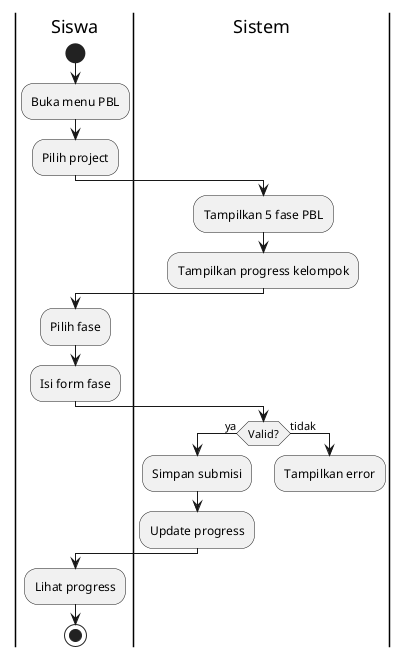

# Activity Diagram - PBL - Kerjakan Project (Siswa)

## Penjelasan:

### Sequential Phases:
- Fase berikutnya **locked** sampai fase sebelumnya **approved**
- Semua anggota kelompok lihat submisi yang sama

### Progress:
- Setiap fase = 20%
- Total 100% = 4 fase dikumpulkan + dinilai

### Status Submisi:
- **Pending**: Menunggu review guru
- **Approved**: Disetujui, unlock fase berikutnya
- **Rejected**: Ditolak, bisa edit ulang
