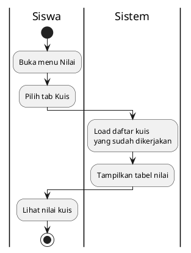
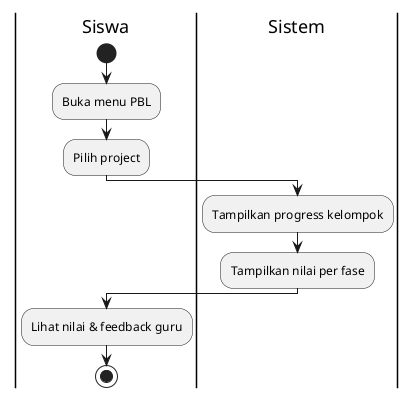

# Activity Diagram - Lihat Nilai (Siswa)

## 13.1 Lihat Nilai Kuis

## Penjelasan:
- Siswa hanya bisa lihat nilai kuis yang sudah dikerjakan
- Tampilan: Nama kuis, nilai, jumlah benar/salah, tanggal

---

## 13.2 Lihat Nilai PBL

## Penjelasan:
- Siswa lihat nilai PBL kelompoknya
- Tampilan: Progress (0-100%), nilai per fase, feedback guru
- Nilai tampil setelah guru beri penilaian
