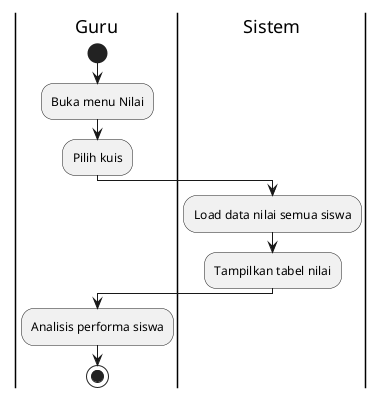
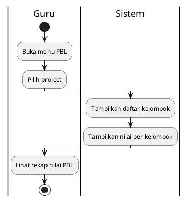

# Activity Diagram - Lihat Nilai (Guru)

## 14.1 Lihat Nilai Kuis

## Penjelasan:
- Guru lihat nilai kuis semua siswa
- Tampilan: Nama siswa, kelas, nilai, tanggal
- Auto grading: Sistem sudah koreksi otomatis

---

## 14.2 Lihat Nilai PBL

## Penjelasan:
- Guru lihat nilai PBL semua kelompok
- Tampilan: Nama kelompok, anggota, progress, nilai
- Nilai berdasarkan penilaian yang sudah diberikan
