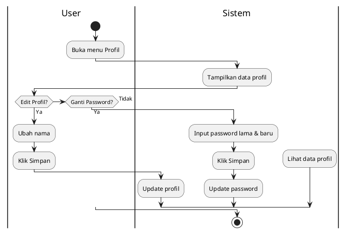

# Activity Diagram Singkat - Manajemen Profil

```plantuml
@startuml Manajemen Profil Singkat
|User|
start
:Buka menu Profil;
|Sistem|
:Tampilkan data profil;
|User|
if (Edit Profil?) then (Ya)
  :Ubah nama;
  :Klik Simpan;
  |Sistem|
  :Update profil;
elseif (Ganti Password?) then (Ya)
  :Input password lama & baru;
  :Klik Simpan;
  |Sistem|
  :Update password;
else (Tidak)
  :Lihat data profil;
endif
stop
@enduml
```
