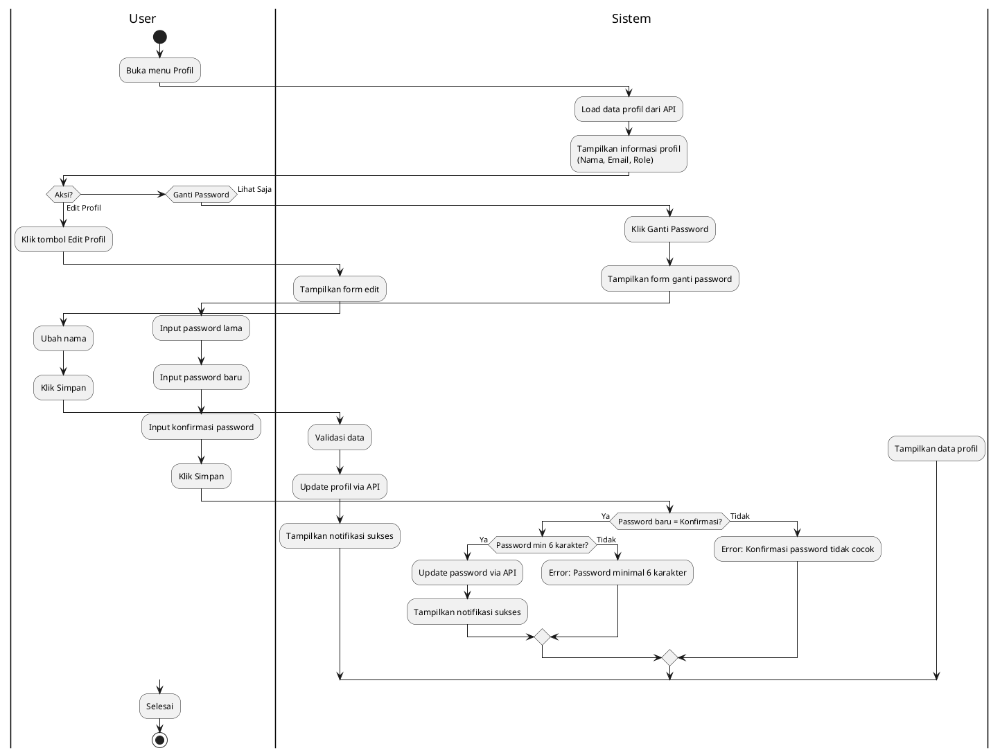
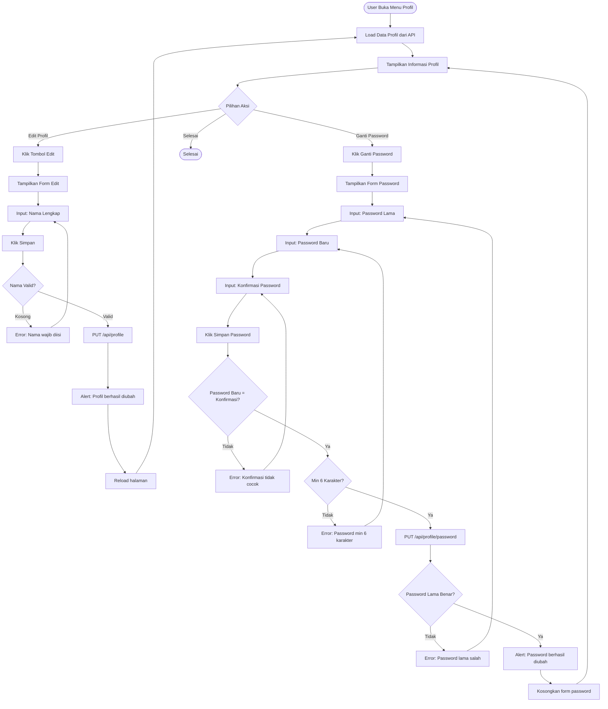

# Activity Diagram - Manajemen Profil

## Deskripsi
Fitur untuk semua role (Admin, Guru, Siswa) mengelola profil dan keamanan akun mereka.

## Flowchart Detail (Mermaid)

## Penjelasan

### Aktor
- **User**: Admin, Guru, atau Siswa (semua role memiliki akses)

### Fitur Utama
1. **Lihat Profil**: Menampilkan nama, email, dan role user
2. **Edit Profil**: Mengubah nama lengkap
3. **Ganti Password**: Mengubah password dengan validasi

### Validasi
| Field | Validasi |
|-------|----------|
| Nama | Wajib diisi |
| Password Lama | Harus cocok dengan password saat ini |
| Password Baru | Minimal 6 karakter |
| Konfirmasi | Harus sama dengan password baru |

### API Endpoints
| Method | Endpoint | Deskripsi |
|--------|----------|-----------|
| GET | `/api/profile` | Ambil data profil |
| PUT | `/api/profile` | Update nama profil |
| PUT | `/api/profile/password` | Ganti password |

### Catatan Keamanan
- Password lama harus diverifikasi sebelum mengubah password
- Email tidak bisa diubah oleh user (hanya admin)
- Session tetap aktif setelah ganti password
