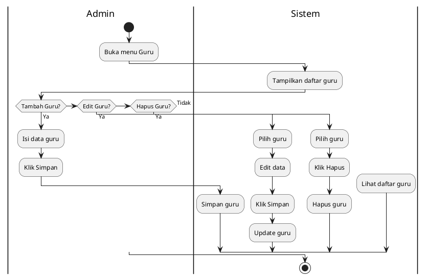

```plantuml
@startuml Manajemen Guru Singkat
|Admin|
start
:Buka menu Guru;
|Sistem|
:Tampilkan daftar guru;
|Admin|
if (Tambah Guru?) then (Ya)
  :Isi data guru;
  :Klik Simpan;
  |Sistem|
  :Simpan guru;
elseif (Edit Guru?) then (Ya)
  :Pilih guru;
  :Edit data;
  :Klik Simpan;
  |Sistem|
  :Update guru;
elseif (Hapus Guru?) then (Ya)
  :Pilih guru;
  :Klik Hapus;
  |Sistem|
  :Hapus guru;
else (Tidak)
  :Lihat daftar guru;
endif
stop
@enduml
```
