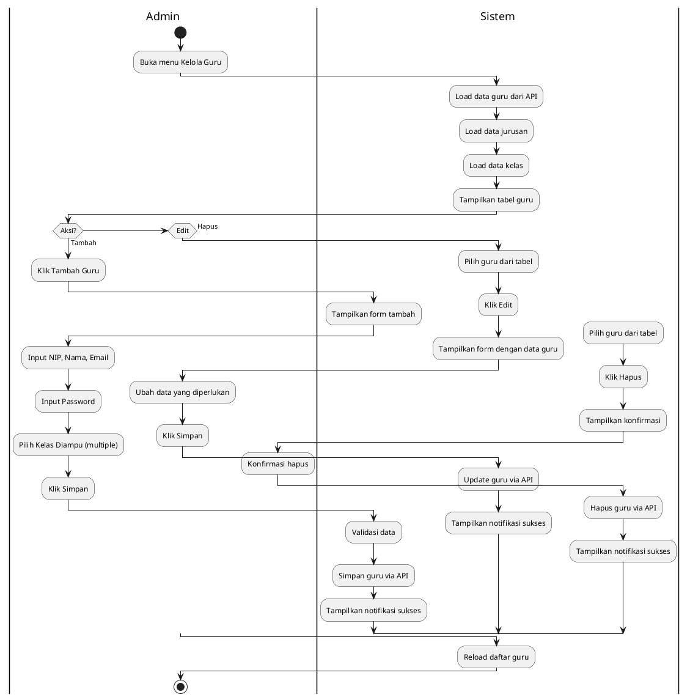
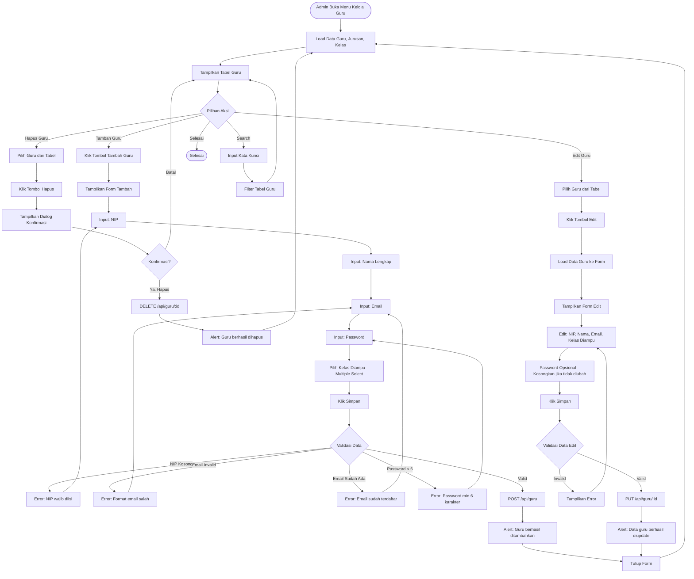

# Activity Diagram - Manajemen Guru (Admin)

## Deskripsi
Fitur untuk Admin mengelola data guru termasuk CRUD dan assignment kelas yang diampu.



## Flowchart Detail (Mermaid)



## Penjelasan

### Aktor
- **Admin**: Satu-satunya role yang bisa mengelola data guru

### Fitur Utama
1. **Lihat Daftar Guru**: Tabel dengan NIP, Nama, Email, Kelas Diampu
2. **Tambah Guru**: Form input data guru baru
3. **Edit Guru**: Ubah data guru yang sudah ada
4. **Hapus Guru**: Hapus guru dengan konfirmasi
5. **Search/Filter**: Cari guru berdasarkan nama/NIP

### Data Form
| Field | Tipe | Validasi | Wajib |
|-------|------|----------|-------|
| NIP | Text | Unique | ✅ |
| Nama | Text | - | ✅ |
| Email | Email | Format valid, Unique | ✅ |
| Password | Password | Min 6 karakter | ✅ (Tambah) / Opsional (Edit) |
| Kelas Diampu | Multi-select | - | ❌ |

### Kelas Diampu
- Guru bisa mengampu **multiple kelas**
- Ditampilkan sebagai checkbox atau multi-select
- Contoh: X RPL 1, X RPL 2, XI RPL 1

### API Endpoints
| Method | Endpoint | Deskripsi |
|--------|----------|-----------|
| GET | `/api/guru` | Ambil semua guru |
| POST | `/api/guru` | Tambah guru baru |
| PUT | `/api/guru/:id` | Update data guru |
| DELETE | `/api/guru/:id` | Hapus guru |

### Relasi Data
```
Guru
├── Jurusan (belongs to)
└── Kelas Diampu (many to many)
    ├── X RPL 1
    ├── X RPL 2
    └── XI RPL 1
```

### Catatan
- Email guru akan menjadi username untuk login
- Password default bisa diset oleh admin, guru bisa ganti sendiri via profil
- Ketika guru dihapus, data materi/kuis yang dibuat tetap ada (soft reference)
