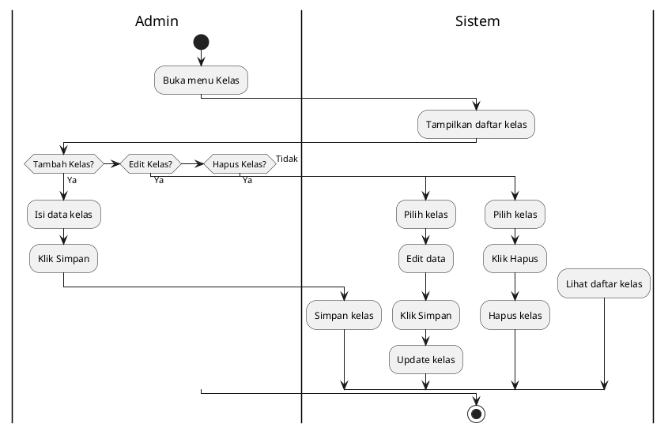

# Activity Diagram Singkat - Manajemen Kelas

```plantuml
@startuml Manajemen Kelas Singkat
|Admin|
start
:Buka menu Kelas;
|Sistem|
:Tampilkan daftar kelas;
|Admin|
if (Tambah Kelas?) then (Ya)
  :Isi data kelas;
  :Klik Simpan;
  |Sistem|
  :Simpan kelas;
elseif (Edit Kelas?) then (Ya)
  :Pilih kelas;
  :Edit data;
  :Klik Simpan;
  |Sistem|
  :Update kelas;
elseif (Hapus Kelas?) then (Ya)
  :Pilih kelas;
  :Klik Hapus;
  |Sistem|
  :Hapus kelas;
else (Tidak)
  :Lihat daftar kelas;
endif
stop
@enduml
```
