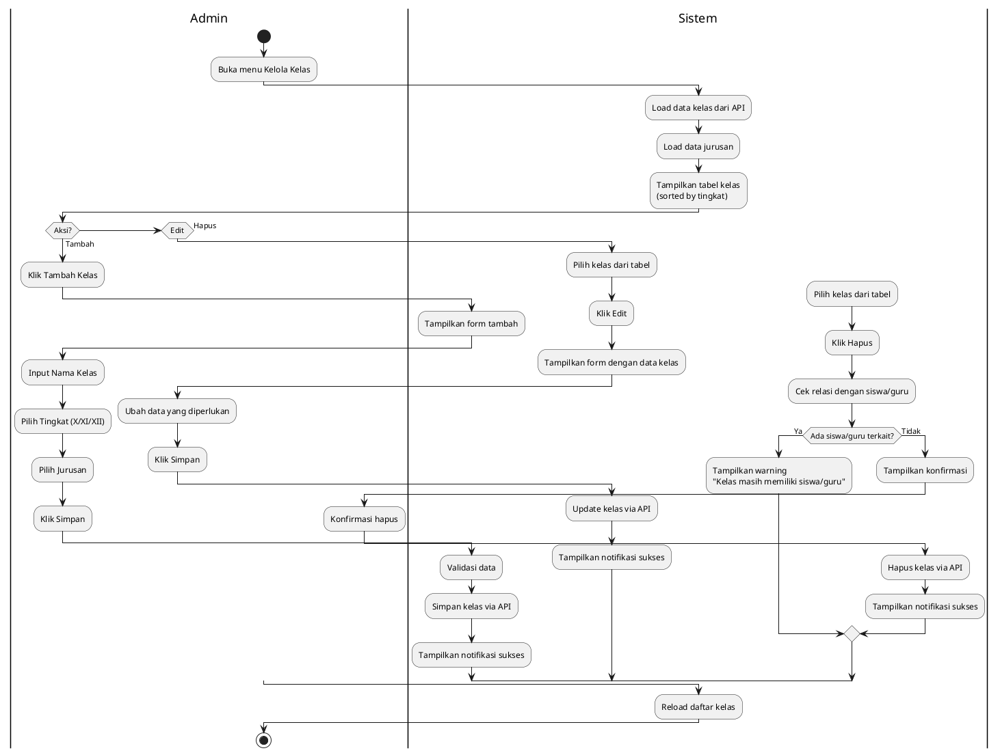
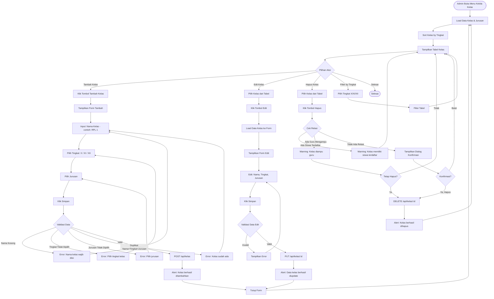

# Activity Diagram - Manajemen Kelas (Admin)

## Deskripsi
Fitur untuk Admin mengelola data kelas termasuk CRUD dengan relasi ke jurusan.



## Flowchart Detail (Mermaid)



## Penjelasan

### Aktor
- **Admin**: Satu-satunya role yang bisa mengelola data kelas

### Fitur Utama
1. **Lihat Daftar Kelas**: Tabel dengan Nama, Tingkat, Jurusan
2. **Tambah Kelas**: Form input kelas baru
3. **Edit Kelas**: Ubah data kelas yang sudah ada
4. **Hapus Kelas**: Hapus kelas dengan cek relasi
5. **Filter by Tingkat**: Filter tampilan berdasarkan tingkat

### Data Form
| Field | Tipe | Validasi | Wajib |
|-------|------|----------|-------|
| Nama | Text | Unique per tingkat+jurusan | ✅ |
| Tingkat | Dropdown | X, XI, XII, VII, VIII, IX | ✅ |
| Jurusan | Dropdown | From jurusan table | ✅ |

### Tingkat yang Tersedia
- **SMA/SMK**: X, XI, XII
- **SMP**: VII, VIII, IX

### Contoh Nama Kelas
| Tingkat | Jurusan | Nama | Hasil Display |
|---------|---------|------|---------------|
| X | RPL | 1 | X RPL 1 |
| XI | TKJ | 2 | XI TKJ 2 |
| XII | MM | 1 | XII MM 1 |

### API Endpoints
| Method | Endpoint | Deskripsi |
|--------|----------|-----------|
| GET | `/api/kelas` | Ambil semua kelas |
| POST | `/api/kelas` | Tambah kelas baru |
| PUT | `/api/kelas/:id` | Update data kelas |
| DELETE | `/api/kelas/:id` | Hapus kelas |

### Relasi Data
```
Kelas
├── Jurusan (belongs to)
│   └── id, nama
├── Siswa (has many)
│   └── Daftar siswa di kelas ini
└── Guru (many to many via kelas_diampu)
    └── Guru yang mengampu kelas ini
```

### Validasi Hapus
1. **Cek siswa**: Jika ada siswa di kelas, tampilkan warning
2. **Cek guru**: Jika ada guru mengampu, tampilkan warning (bisa force delete)
3. **Tidak ada relasi**: Langsung tampilkan konfirmasi hapus

### Sorting Default
Tabel di-sort berdasarkan:
1. Tingkat (X → XI → XII)
2. Nama kelas (ascending)
