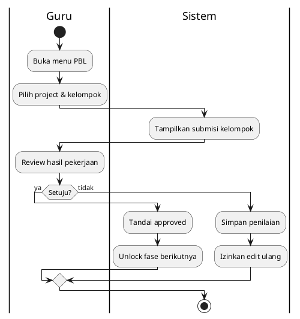
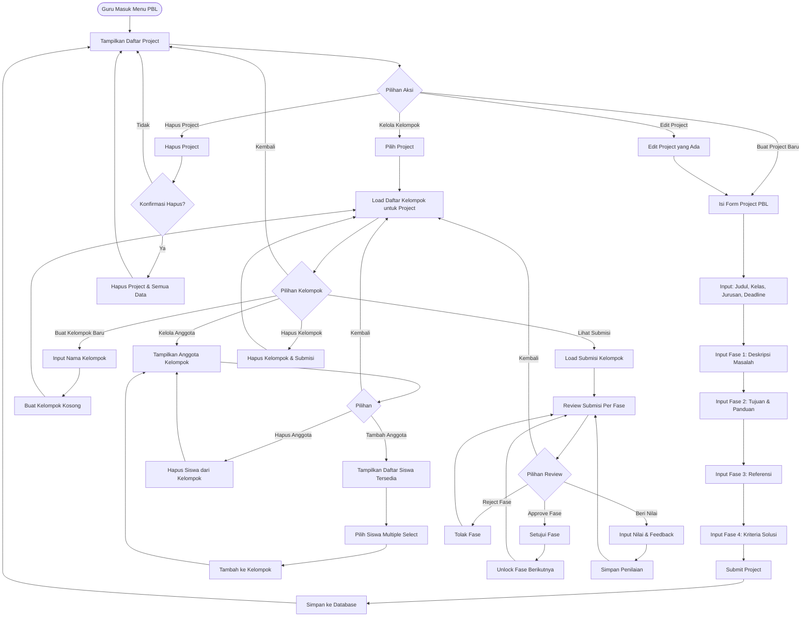
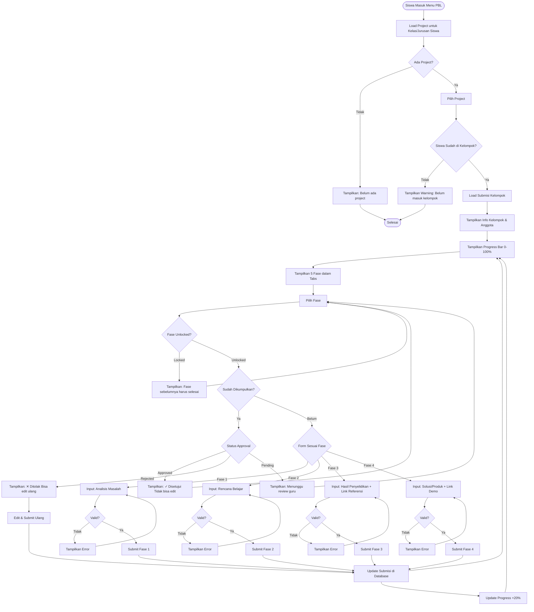

# Activity Diagram - PBL - Review & Penilaian (Guru)

## Penjelasan:

### Workflow Review:
- Guru review submisi kelompok per fase
- Keputusan: Setujui atau Tolak
- Sistem update status dan unlock fase berikutnya

### Sequential Approval:
- Fase berikutnya terbuka setelah fase sebelumnya disetujui

---

## Diagram Lainnya (Legacy)

## 2.2 Siswa: Kerjakan PBL Per Fase

## Keterangan PBL:

### Guru Side:
1. **Buat Project**: Isi 5 fase sekaligus (orientasi masalah → evaluasi)
2. **Buat Kelompok**: Nama kelompok, tambah anggota dari list siswa
3. **Review Submisi**: Per kelompok, per fase, approve/reject
4. **Penilaian**: Nilai akhir + feedback untuk kelompok

### Siswa Side:
1. **Sequential Phases**: Fase 2 baru bisa dikerjakan jika Fase 1 approved
2. **Group Work**: 1 submisi per kelompok, semua anggota lihat yang sama
3. **Progress Tracking**: 20% per fase (100% = semua fase approved + dinilai)
4. **Resubmit**: Bisa edit ulang jika ditolak guru

### 5 Fase PBL:
- **Fase 1**: Orientasi pada Masalah (analisis masalah)
- **Fase 2**: Organisasi Belajar (rencana belajar)
- **Fase 3**: Penyelidikan (hasil investigasi + referensi)
- **Fase 4**: Hasil Karya (solusi/produk + demo)
- **Fase 5**: Evaluasi (penilaian oleh guru)
