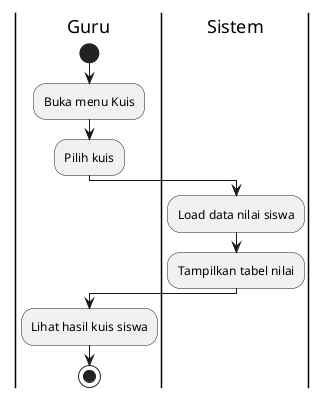
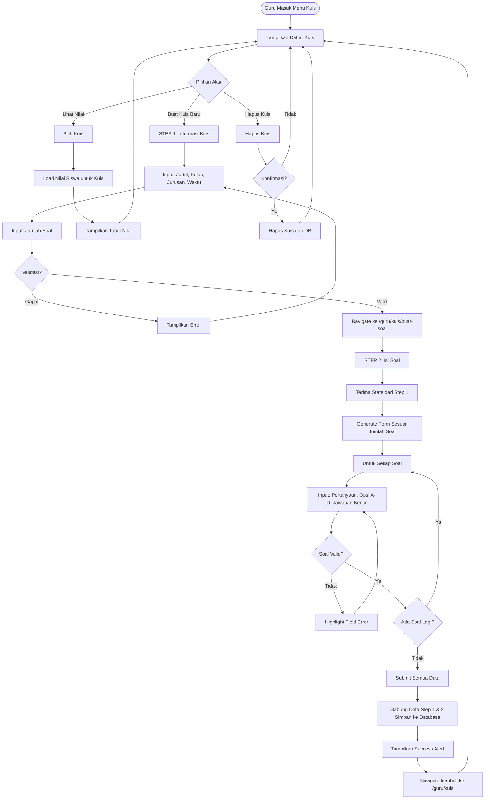
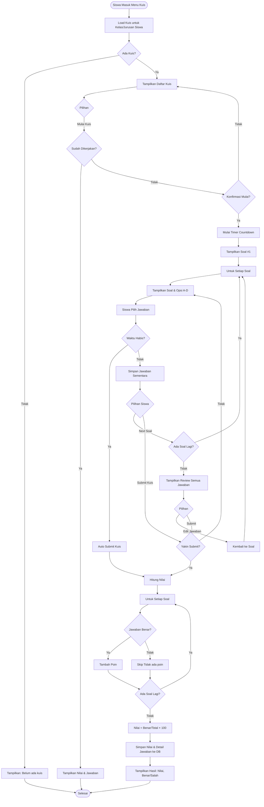

# Activity Diagram - Lihat Nilai Kuis (Guru)



## Penjelasan:

### Data Nilai:
- Nama siswa, kelas, nilai
- Jumlah benar dari total soal

### Auto Grading:
- Sistem koreksi otomatis saat siswa submit
- Guru hanya melihat hasil

## 3.1 Guru: Buat Kuis (2-Step Wizard)



## 3.2 Siswa: Kerjakan Kuis



## Keterangan Kuis:

### Guru Side (2-Step Wizard):
1. **Step 1 - Info Kuis**: 
   - Judul, Kelas, Jurusan, Durasi (menit), Jumlah soal
   - Validasi sebelum lanjut ke step 2
   
2. **Step 2 - Isi Soal**:
   - Navigate ke halaman baru (/guru/kuis/buat-soal)
   - State passing via React Router navigate
   - Form dinamis sesuai jumlah soal
   - Validasi per soal (pertanyaan, 4 opsi, jawaban benar harus dipilih)
   - Auto scroll ke soal berikutnya setelah valid

### Siswa Side:
1. **Filter Otomatis**: Hanya tampil kuis sesuai kelas/jurusan siswa
2. **One-Time Attempt**: Sekali dikerjakan, tidak bisa ulang
3. **Timer Countdown**: Otomatis submit jika waktu habis
4. **Auto Grading**: Sistem langsung koreksi & hitung nilai
5. **Review Jawaban**: Siswa bisa lihat jawaban benar/salah setelah submit

### Perhitungan Nilai:
```
Nilai = (Jumlah Jawaban Benar / Total Soal) × 100
```

Contoh: 8 benar dari 10 soal = 80
