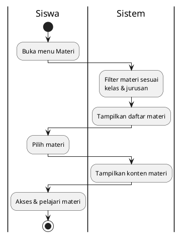
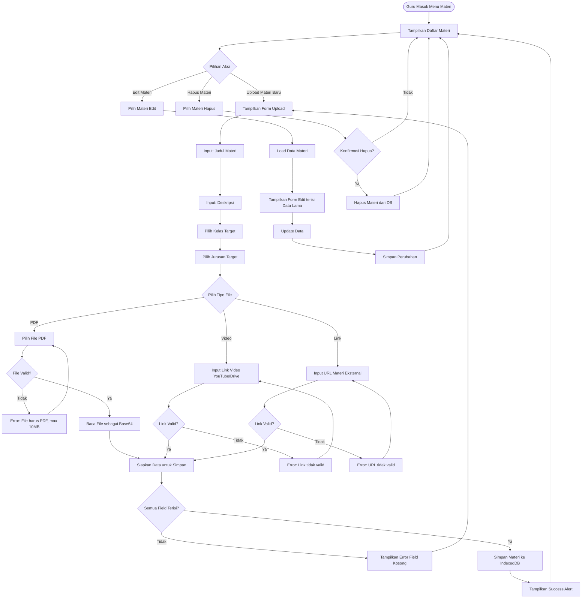
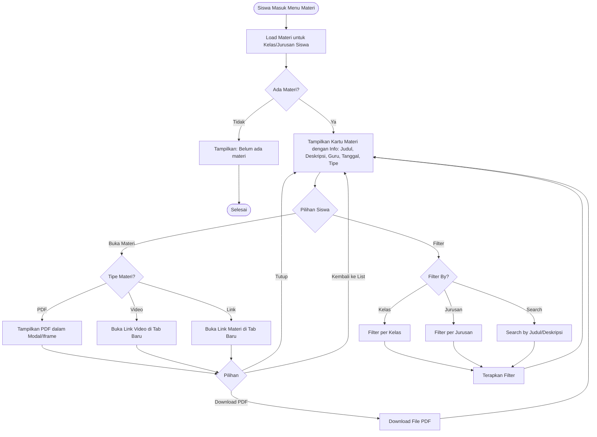

# Activity Diagram - Akses Materi (Siswa)

## Penjelasan:

### Akses Materi:
- Sistem filter otomatis sesuai kelas/jurusan siswa
- Materi berupa PDF, Video, atau Link eksternal
- Siswa dapat mengakses dan mempelajari materi

## 4.1 Guru: Upload & Kelola Materi

## 4.2 Siswa: Akses Materi

## Keterangan Materi:

### Guru Side:
1. **3 Tipe Materi**:
   - **PDF**: Upload file PDF (max 10MB), disimpan sebagai base64 di IndexedDB
   - **Video**: Link eksternal (YouTube, Google Drive, dll)
   - **Link**: URL eksternal (website, dokumentasi, dll)

2. **Target Kelas/Jurusan**: Materi bisa ditargetkan ke kelas & jurusan tertentu

3. **Metadata**: Judul, deskripsi, pembuat (guru), tanggal upload

### Siswa Side:
1. **Auto Filter**: Hanya tampil materi sesuai kelas/jurusan siswa
2. **View Options**:
   - PDF: Tampil dalam modal/iframe, bisa download
   - Video/Link: Buka di tab baru
3. **Search & Filter**: Cari materi by judul atau filter by kelas/jurusan

### Storage:
- **IndexedDB**: File PDF disimpan sebagai base64
- **Links**: Hanya URL disimpan, file sebenarnya di eksternal
- **Offline Support**: PDF bisa diakses offline, video/link butuh internet

### Validasi:
- PDF max 10MB
- Link harus format URL valid
- Semua field wajib diisi
