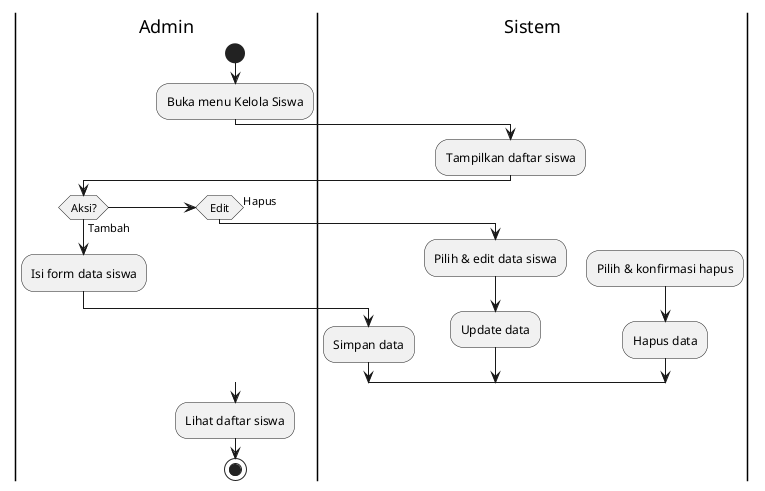
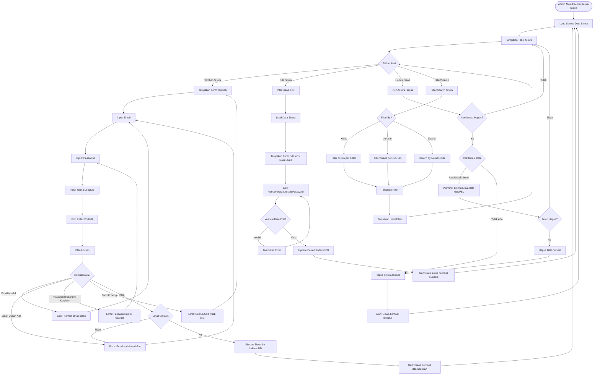

# Activity Diagram - Kelola Siswa (Admin)



## Penjelasan:

### Swimlane:
- **Admin**: Aktivitas administrator
- **Sistem**: Proses sistem

### Operasi CRUD:
1. **Tambah**: Input data siswa baru dengan validasi
2. **Edit**: Ubah data siswa yang sudah ada
3. **Hapus**: Hapus siswa dengan konfirmasi

### Validasi:
- Email format dan unique
- Password minimum 6 karakter
- Semua field wajib diisi
- Kelas dan jurusan dari dropdown



## Keterangan Kelola Siswa:

### Data Siswa:
```typescript
{
  email: string        // Unique, untuk login
  password: string     // Hash/plain untuk autentikasi
  nama: string         // Nama lengkap siswa
  kelas: 'X' | 'XI' | 'XII'
  jurusan: string      // ID jurusan (foreign key)
  createdAt: string    // Timestamp
}
```

### Operasi CRUD:

1. **CREATE (Tambah Siswa)**:
   - Validasi format email
   - Cek email unique (tidak duplikat)
   - Password minimum 6 karakter
   - Kelas dari dropdown (X/XI/XII)
   - Jurusan dari dropdown (load dari tabel jurusan)

2. **READ (View & Filter)**:
   - Tampilkan semua siswa dalam tabel
   - Filter by kelas atau jurusan
   - Search by nama atau email
   - Info: Email, Nama, Kelas, Jurusan, Tanggal Daftar

3. **UPDATE (Edit)**:
   - Bisa edit semua field kecuali email (karena unique key)
   - Validasi sama seperti tambah
   - Update langsung ke IndexedDB

4. **DELETE (Hapus)**:
   - Konfirmasi sebelum hapus
   - Warning jika siswa punya data nilai/PBL/submisi
   - Option: hapus cascade (termasuk data terkait) atau cancel

### Relasi Data:
- **Jurusan**: Foreign key ke tabel jurusan
- **Nilai Kuis**: 1 siswa bisa punya banyak nilai
- **PBL Submisi**: Siswa bisa jadi anggota kelompok PBL
- **Perlu cascade delete** atau **soft delete** untuk integritas data

### UI Features:
- Tabel dengan pagination (jika banyak data)
- Sort by kolom (nama, kelas, jurusan, tanggal)
- Bulk actions (hapus multiple siswa)
- Export data (CSV/Excel) - optional
