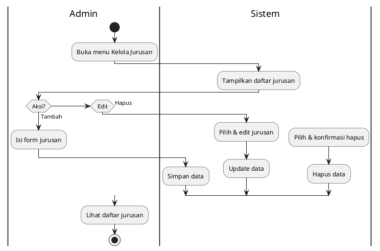
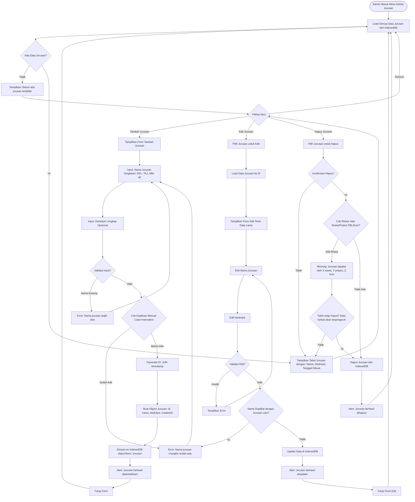

# Activity Diagram - Kelola Jurusan (Admin)



## Penjelasan:

### Operasi:
1. **Tambah**: Input jurusan baru (nama wajib unique)
2. **Edit**: Ubah nama/deskripsi jurusan
3. **Hapus**: Hapus jurusan dengan cek relasi

### Validasi:
- Nama jurusan tidak boleh duplikat (case-insensitive)
- Peringatan jika jurusan masih dipakai siswa/PBL/kuis



## Keterangan Kelola Jurusan:

### Data Jurusan:
```typescript
{
  id: string           // JUR-{timestamp} - auto generated
  nama: string         // Singkatan: RPL, TKJ, MM, AKL, dll
  deskripsi?: string   // Nama lengkap (optional)
  createdAt: string    // ISO timestamp
}
```

### Default Jurusan:
Saat database pertama kali dibuat (onupgradeneeded), sistem auto-insert:
```javascript
[
  { id: 'JUR-1', nama: 'RPL', deskripsi: 'Rekayasa Perangkat Lunak' },
  { id: 'JUR-2', nama: 'TKJ', deskripsi: 'Teknik Komputer dan Jaringan' },
  { id: 'JUR-3', nama: 'MM', deskripsi: 'Multimedia' },
  { id: 'JUR-4', nama: 'AKL', deskripsi: 'Akuntansi dan Keuangan Lembaga' }
]
```

### Operasi CRUD:

1. **CREATE (Tambah Jurusan)**:
   - Input nama jurusan (wajib)
   - Input deskripsi (optional)
   - Validasi: nama tidak boleh kosong
   - Cek duplikasi manual (case-insensitive):
     ```javascript
     const namaBaru = jurusan.nama.trim().toUpperCase()
     const sudahAda = semuaData.some(j => j.nama.trim().toUpperCase() === namaBaru)
     ```
   - Generate ID unik: `JUR-${Date.now()}`
   - Simpan ke IndexedDB

2. **READ (View)**:
   - Load semua jurusan dari `semuaJurusan()`
   - Tampilkan dalam tabel/list
   - Info: Nama, Deskripsi, Tanggal dibuat

3. **UPDATE (Edit)**:
   - Load data jurusan by ID
   - Form pre-filled dengan data lama
   - Bisa edit nama & deskripsi
   - Validasi sama seperti tambah
   - Cek duplikasi (kecuali dengan diri sendiri)
   - Update via `updateJurusan(id, data)`

4. **DELETE (Hapus)**:
   - Konfirmasi sebelum hapus
   - **Cek relasi** dengan:
     - Siswa (field `jurusan`)
     - Project PBL (field `jurusan`)
     - Kuis (field `jurusan`)
   - Warning jika ada relasi
   - Option: tetap hapus atau cancel
   - Hapus via `hapusJurusan(id)`

### Relasi Data:
- **Siswa**: Field `jurusan` (foreign key)
- **Project PBL**: Field `jurusan`
- **Kuis**: Field `jurusan`
- **Materi**: Field `jurusan`

**Risiko Hapus Jurusan**:
- Data siswa/PBL/kuis jadi punya jurusan ID yang tidak valid
- **Solusi**: 
  - Soft delete (tambah flag `isDeleted`)
  - Cascade update (ubah ke jurusan default)
  - Block delete jika ada relasi (recommended)

### UI Features:
- Form modal untuk tambah/edit
- Tabel sederhana (tidak perlu pagination, jurusan sedikit)
- Konfirmasi dialog untuk hapus
- Alert success/error

### IndexedDB:
```javascript
DB_NAME: 'JagatKawruhDB'
STORE_NAME: 'jurusan'
DB_VERSION: 8
Index: 'nama' (non-unique untuk manual check)
```

### Validasi:
1. **Nama**: Required, trim whitespace, case-insensitive duplicate check
2. **Deskripsi**: Optional, max 200 karakter
3. **Unique Check**: Manual loop karena case-insensitive
