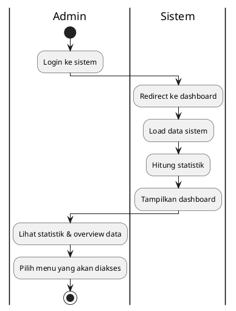
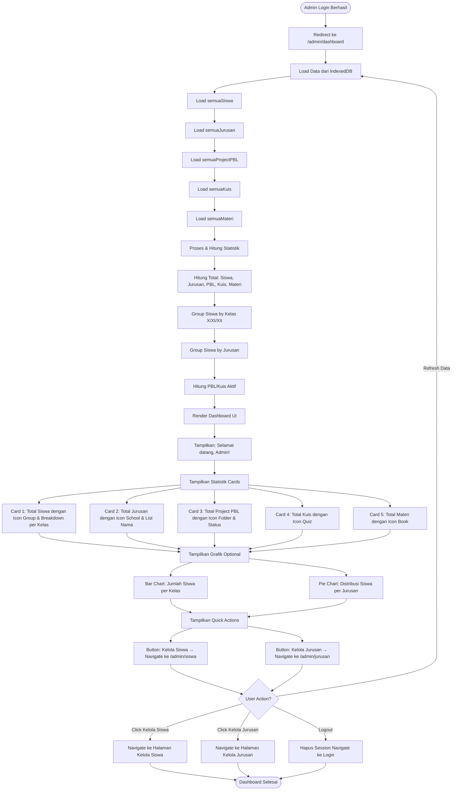

# Activity Diagram - Dashboard Admin



## Penjelasan:

### Fungsi Dashboard:
- Menampilkan overview statistik sistem
- Gateway untuk akses menu admin (Kelola Siswa, Kelola Jurusan)

### Data yang Ditampilkan:
- Total siswa, jurusan, PBL, kuis, materi
- Breakdown data per kategori



## Keterangan Dashboard Admin:

### Data yang Ditampilkan:

1. **Statistik Utama (Cards)**:
   ```
   ┌─────────────────────┐  ┌─────────────────────┐
   │ 👥 Total Siswa      │  │ 🏫 Total Jurusan    │
   │     125             │  │      4              │
   │ X: 45 | XI: 50 ...  │  │ RPL, TKJ, MM, AKL   │
   └─────────────────────┘  └─────────────────────┘
   
   ┌─────────────────────┐  ┌─────────────────────┐
   │ 📁 Project PBL      │  │ 📝 Total Kuis       │
   │     12              │  │      8              │
   │ Aktif: 5 Draft: 7   │  │ Kelas X: 3, XI: 5   │
   └─────────────────────┘  └─────────────────────┘
   
   ┌─────────────────────┐
   │ 📚 Total Materi     │
   │     25              │
   │ PDF: 15, Video: 10  │
   └─────────────────────┘
   ```

2. **Visualisasi (Optional)**:
   - **Bar Chart**: Jumlah siswa per kelas (X, XI, XII)
   - **Pie Chart**: Distribusi siswa per jurusan
   - **Line Chart**: Trend aktivitas per bulan (optional)

3. **Quick Actions**:
   - **Kelola Siswa**: Navigate ke menu CRUD siswa
   - **Kelola Jurusan**: Navigate ke menu CRUD jurusan
   - **Lihat Laporan**: Generate laporan (future feature)

### Data Sources:

```typescript
// Load dari IndexedDB
const siswa = await semuaSiswa()
const jurusan = await semuaJurusan()
const pblProjects = await semuaProjectPBL()
const kuis = await semuaKuis()
const materi = await semuaMateri()

// Hitung statistik
const stats = {
  totalSiswa: siswa.length,
  siswaPerKelas: {
    X: siswa.filter(s => s.kelas === 'X').length,
    XI: siswa.filter(s => s.kelas === 'XI').length,
    XII: siswa.filter(s => s.kelas === 'XII').length
  },
  siswaPerJurusan: jurusan.map(j => ({
    nama: j.nama,
    count: siswa.filter(s => s.jurusan === j.id).length
  })),
  totalJurusan: jurusan.length,
  totalPBL: pblProjects.length,
  pblAktif: pblProjects.filter(p => p.status === 'Aktif').length,
  totalKuis: kuis.length,
  totalMateri: materi.length
}
```

### UI Layout:

```
┌────────────────────────────────────────────────┐
│ JAGAT KAWRUH - Area Admin                     │
│ Selamat datang, Admin! 👋                      │
└────────────────────────────────────────────────┘

┌──────────────┐ ┌──────────────┐ ┌──────────────┐
│ Card Siswa   │ │ Card Jurusan │ │ Card PBL     │
└──────────────┘ └──────────────┘ └──────────────┘

┌──────────────┐ ┌──────────────┐
│ Card Kuis    │ │ Card Materi  │
└──────────────┘ └──────────────┘

┌────────────────────────────────────────────────┐
│ 📊 Grafik Distribusi Siswa                     │
│ [Bar Chart: X, XI, XII]                        │
│ [Pie Chart: RPL, TKJ, MM, AKL]                 │
└────────────────────────────────────────────────┘

┌────────────────────────────────────────────────┐
│ Quick Actions:                                 │
│ [🔧 Kelola Siswa] [🏫 Kelola Jurusan]          │
└────────────────────────────────────────────────┘
```

### Features:

1. **Real-time Stats**:
   - Data selalu up-to-date saat dashboard dibuka
   - Refresh otomatis saat kembali dari menu lain

2. **Responsive Cards**:
   - Grid layout: 3 kolom desktop, 2 kolom tablet, 1 kolom mobile
   - Icon + angka besar + detail kecil

3. **Interactive Charts** (jika pakai library chart):
   - Hover untuk detail
   - Click legend untuk filter
   - Export gambar (optional)

4. **Navigation**:
   - Click card → navigate ke menu terkait
   - Quick action buttons di bawah

### Dependencies:

Jika mau pakai chart visualization, bisa tambahkan:
```bash
npm install recharts
# atau
npm install chart.js react-chartjs-2
```

Tapi bisa juga pakai **CSS progress bar** sederhana tanpa library!

### State Management:

```typescript
const [loading, setLoading] = useState(true)
const [stats, setStats] = useState({
  totalSiswa: 0,
  totalJurusan: 0,
  totalPBL: 0,
  totalKuis: 0,
  totalMateri: 0,
  siswaPerKelas: { X: 0, XI: 0, XII: 0 },
  siswaPerJurusan: []
})

useEffect(() => {
  loadDashboardData()
}, [])

async function loadDashboardData() {
  // Load & process data
  // Update stats state
  setLoading(false)
}
```

### Error Handling:

```
Try-Catch saat load data
→ Jika error: Tampilkan "Error loading dashboard data"
→ Button: Retry
```
