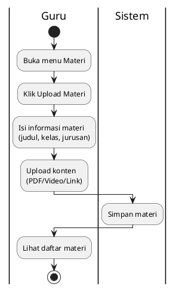

# Activity Diagram - Kelola Materi (Guru)

## Penjelasan:

### Tipe Materi:
1. **PDF**: Upload file (max 10MB), disimpan base64
2. **Video**: Link eksternal (YouTube, Drive)
3. **Link**: URL materi eksternal

### Target:
- Pilih kelas (X/XI/XII)
- Pilih jurusan
- Siswa hanya lihat materi sesuai kelas/jurusannya
