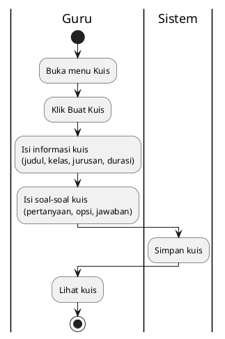

# Activity Diagram - Buat Kuis (Guru)

## Penjelasan:

### 2-Step Wizard:
1. **Step 1**: Info kuis (judul, target, durasi, jumlah soal)
2. **Step 2**: Isi soal (form dinamis sesuai jumlah)

### Validasi:
- Semua field wajib diisi
- Setiap soal: pertanyaan + 4 opsi + jawaban benar
- Auto-scroll ke soal berikutnya setelah valid
