# Class Diagram - Jagat Kawruh

Diagram kelas UML untuk sistem **Jagat Kawruh** — LMS berbasis PBL dengan gamifikasi kuis wayang.

> **Catatan:** Getter/setter tidak ditampilkan (implied oleh atribut). Hanya method CRUD dan domain-specific yang ditampilkan.

## Class Diagram

```mermaid
classDiagram
    direction TB

    %% ══════════════════════════════════════
    %% AUTHENTICATION & USER
    %% ══════════════════════════════════════

    class Role {
        <<enumeration>>
        admin
        guru
        siswa
    }

    class Session {
        -Role role
        -string email
        -string nama
        -string kelas
        -string kelas_id
        -string jurusan
        +getSession() Session
        +getCurrentUser() Session
        +setSession(session) void
        +clearSession() void
    }

    class AuthAPI {
        <<service>>
        +login(email, password) Response
        +logout() void
        +me() Response
        +register(data) Response
    }

    class Guru {
        -number id
        -string nip
        -string nama
        -string email
        -number jurusan_id
        -string nama_jurusan
        -number[] kelas_diampu
        +getAll(params) Guru[]
        +getById(id) Guru
        +create(data) Guru
        +update(id, data) Guru
        +delete(id) void
    }

    class Siswa {
        -number id
        -string nis
        -string nama
        -string email
        -string kelas
        -number kelas_id
        -number jurusan_id
        -string nama_jurusan
        +getAll(params) Siswa[]
        +getById(id) Siswa
        +me() Siswa
        +create(data) Siswa
        +update(id, data) Siswa
        +delete(id) void
        +import(file) void
    }

    Session --> Role : role
    AuthAPI ..> Session : returns

    %% ══════════════════════════════════════
    %% AKADEMIK
    %% ══════════════════════════════════════

    class Jurusan {
        -number id
        -string nama
        -string deskripsi
        +getAll() Jurusan[]
        +getById(id) Jurusan
        +create(data) Jurusan
        +update(id, data) Jurusan
        +delete(id) void
    }

    class Kelas {
        -number id
        -string nama
        -string tingkat
        -number jurusan_id
        -string nama_jurusan
        +getAll(params) Kelas[]
        +getById(id) Kelas
        +create(data) Kelas
        +update(id, data) Kelas
        +delete(id) void
    }

    Jurusan "1" --> "*" Kelas : memiliki
    Kelas "1" --> "*" Siswa : berisi
    Siswa "*" --> "1" Jurusan : jurusan_id
    Guru "*" --> "*" Kelas : kelas_diampu
    Guru "*" --> "1" Jurusan : jurusan_id

    %% ══════════════════════════════════════
    %% PBL DOMAIN
    %% ══════════════════════════════════════

    class ProjectPBL {
        -number id
        -string judul
        -string masalah
        -string tujuan_pembelajaran
        -string panduan
        -string referensi
        -number[] kelas_ids
        -number jurusan_id
        -string status
        -string deadline
        +getAll(params) ProjectPBL[]
        +getById(id) ProjectPBL
        +create(data) ProjectPBL
        +update(id, data) ProjectPBL
        +delete(id) void
    }

    class Sintaks {
        -number id
        -number urutan
        -string nama_fase
        -string judul
        -string deskripsi
        -string instruksi
        +getSintaks(projectId) Sintaks[]
        +createSintaks(projectId, data) Sintaks
        +updateSintaks(projectId, sintaksId, data) Sintaks
        +deleteSintaks(projectId, sintaksId) void
    }

    class Kelompok {
        -number id
        -string nama_kelompok
        -number[] anggota
        +getKelompok(projectId) Kelompok[]
        +createKelompok(projectId, data) Kelompok
        +updateKelompok(projectId, kelompokId, data) Kelompok
        +deleteKelompok(projectId, kelompokId) void
    }

    class Submission {
        -number id
        -number project_id
        -number kelompok_id
        -string file_name
        -string file_path
        -string catatan
        -number nilai
        -string feedback
        -string submitted_at
        +getSubmissions(projectId) Submission[]
        +submitProject(projectId, data) Submission
        +nilaiSubmission(submissionId, data) void
    }

    class ProgressData {
        -string pbl_id
        -string kelompok_id
        -number total_sintaks
        -number completed_sintaks
        -number completion_percentage
        -ProgressItem[] progress
        +getProgress(pblId, kelompokId) ProgressData
    }

    class ProgressItem {
        -string sintaks_id
        -string nama_fase
        -string judul
        -number urutan
        -string catatan
        -string file_path
        -boolean completed
        -string submitted_at
        +getSintaksProgress(pblId, sintaksId) ProgressItem
        +submitProgress(pblId, sintaksId, data) ProgressItem
        +deleteProgress(pblId, sintaksId) void
    }

    ProjectPBL "1" --> "*" Sintaks : fase
    ProjectPBL "1" --> "*" Kelompok : kelompok
    ProjectPBL "*" --> "*" Kelas : kelas_ids
    ProjectPBL "1" --> "*" Submission : submissions
    Kelompok "*" --> "*" Siswa : anggota
    Kelompok "1" --> "*" Submission : kelompok_id
    ProgressData "1" --> "*" ProgressItem : progress
    ProgressItem "*" --> "1" Sintaks : sintaks_id

    %% ══════════════════════════════════════
    %% KUIS DOMAIN
    %% ══════════════════════════════════════

    class KuisItem {
        -number id
        -string judul
        -string status
        -number peserta
        -Question[] soal
        -number batas_waktu
        +getAll(params) KuisItem[]
        +getById(id) KuisItem
        +create(data) KuisItem
        +update(id, data) KuisItem
        +delete(id) void
        +getNilai(id, params) any[]
    }

    class Question {
        -number id
        -string pertanyaan
        -string image
        -object pilihan
        -string jawaban
        -number urutan
        +normalizeSoal(soal) Question[]
    }

    class StoredAttempt {
        -string attemptId
        -string token
        -string endsAt
        -Record answers
        +startAttempt(kuisId) StoredAttempt
        +getAttemptQuestions(kuisId, attemptId, token) any
        +autosaveAnswers(kuisId, attemptId, token, data) void
        +submitAttempt(kuisId, attemptId, token, data) any
        +checkAnswer(kuisId, attemptId, token, soalId, jawaban) boolean
        +listAttempts(kuisId) StoredAttempt[]
        +getAttemptDetail(kuisId, attemptId) any
    }

    class Attempt {
        -number id
        -number kuis_id
        -string judul_kuis
        -string tanggal
        -number nilai
        -number score
        -number benar
        -number total_soal
    }

    KuisItem "1" --> "*" Question : soal
    KuisItem "*" --> "*" Kelas : kelas_ids
    KuisItem "1" --> "*" Attempt : attempts

    %% ══════════════════════════════════════
    %% MATERI DOMAIN
    %% ══════════════════════════════════════

    class MateriItem {
        -number id
        -string judul
        -number[] kelas_ids
        -string status
        -string file_path
        -string file_name
        -number file_size
        +getAll(params) MateriItem[]
        +getById(id) MateriItem
        +create(data) MateriItem
        +update(id, data) MateriItem
        +delete(id) void
        +download(id) void
        +open(id) void
    }

    MateriItem "*" --> "*" Kelas : kelas_ids

    %% ══════════════════════════════════════
    %% GAME ENGINE (Gamifikasi Kuis Wayang)
    %% ══════════════════════════════════════

    class WayangCharacter {
        <<enumeration>>
        arjuna
        bima
        gatotkaca
        srikandi
        semar
    }

    class Achievement {
        -string id
        -string name
        -string description
        -string emoji
        -boolean unlocked
        -string unlockedAt
    }

    class GameSession {
        -number hp
        -number maxHp
        -number streak
        -number maxStreak
        -number score
        -Record powerUps
        -number startTime
        -number correctAnswers
        -number wrongAnswers
    }

    class GameProfile {
        -string siswaId
        -WayangCharacter selectedCharacter
        -number totalQuizzes
        -number totalPoints
        -number highestStreak
        -string[] achievements
        -object stats
    }

    class GameStateManager {
        +getProfile(siswaId) GameProfile
        +saveProfile(profile) void
        +selectCharacter(character, siswaId) void
        +startSession(kuisId) GameSession
        +getSession(kuisId) GameSession
        +updateSession(kuisId, updates) void
        +handleCorrectAnswer(kuisId) object
        +handleWrongAnswer(kuisId, hasShield) object
        +usePowerUp(kuisId, type) boolean
        +completeSession(kuisId, finalScore, siswaId) Achievement[]
        +getAllAchievements(siswaId) Achievement[]
        +resetProfile() void
        +clearSession(kuisId) void
    }

    GameStateManager ..> GameSession : manages
    GameStateManager ..> GameProfile : saves/loads
    GameStateManager ..> Achievement : checks
    GameProfile --> WayangCharacter : selectedCharacter
    GameProfile ..> Siswa : siswaId

    %% ══════════════════════════════════════
    %% SUPPORT
    %% ══════════════════════════════════════

    class Notifikasi {
        -number id
        -string judul
        -string pesan
        -string tipe
        -boolean dibaca
        -string createdAt
        -string targetSiswa
        +getAll(params) Notifikasi[]
        +create(data) Notifikasi
        +markAsRead(id) void
        +delete(id) void
    }

    class Ticket {
        -number id
        -string judul
        -string deskripsi
        -string kategori
        -string status
        -string pengirim
        -object[] balasan
        -string createdAt
        +getAll(params) Ticket[]
        +getById(id) Ticket
        +create(data) Ticket
        +updateStatus(id, data) void
        +delete(id) void
    }

    class Nilai {
        <<service>>
        +getNilai(params) any[]
        +getNilaiByKelas(kelas) any[]
    }

    class Profile {
        <<service>>
        +get() any
        +update(data) void
        +changePassword(data) void
    }

    Notifikasi ..> Siswa : targetSiswa
    Nilai ..> Attempt : returns
    Profile ..> Session : manages
```

## Keterangan

### Konvensi
| Simbol | Arti |
|--------|------|
| `-` | Private (atribut) |
| `+` | Public (method) |
| `──>` | Asosiasi (has-a) |
| `..>` | Dependency (uses) |
| `"1" --> "*"` | One-to-Many |
| `"*" --> "*"` | Many-to-Many |

> **Getter/setter** tidak ditampilkan karena sudah implied oleh atribut. Hanya method **CRUD** dan **domain-specific** yang ditampilkan.

### Grup Entitas
| Grup | Entitas |
|------|---------|
| **Auth & User** | Session, Role, AuthAPI, Guru, Siswa |
| **Akademik** | Jurusan, Kelas |
| **PBL** | ProjectPBL, Sintaks, Kelompok, Submission, ProgressData, ProgressItem |
| **Kuis** | KuisItem, Question, StoredAttempt, Attempt |
| **Materi** | MateriItem |
| **Game Engine** | GameStateManager, GameSession, GameProfile, WayangCharacter, Achievement |
| **Support** | Notifikasi, Ticket, Nilai, Profile |

### 5 Fase Standar PBL (Auto-Generated)
1. **Orientasi pada Masalah** — Memahami dan menganalisis permasalahan
2. **Organisasi Belajar** — Merencanakan langkah penyelesaian  
3. **Penyelidikan Individual/Kelompok** — Mengumpulkan data dan informasi
4. **Mengembangkan dan Menyajikan Hasil Karya** — Membuat solusi/produk
5. **Evaluasi Proses Pemecahan Masalah** — Refleksi dan evaluasi
